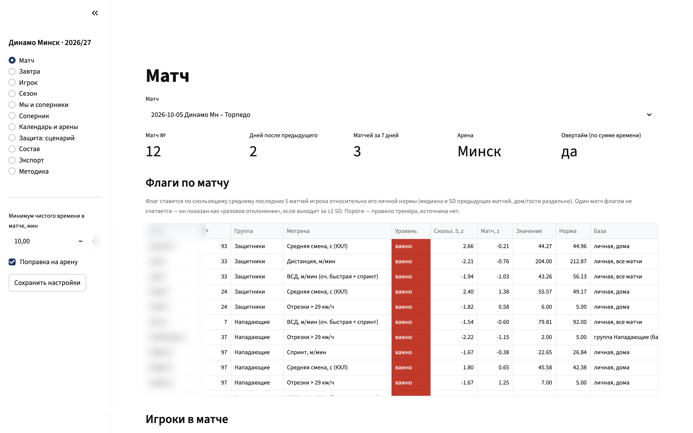
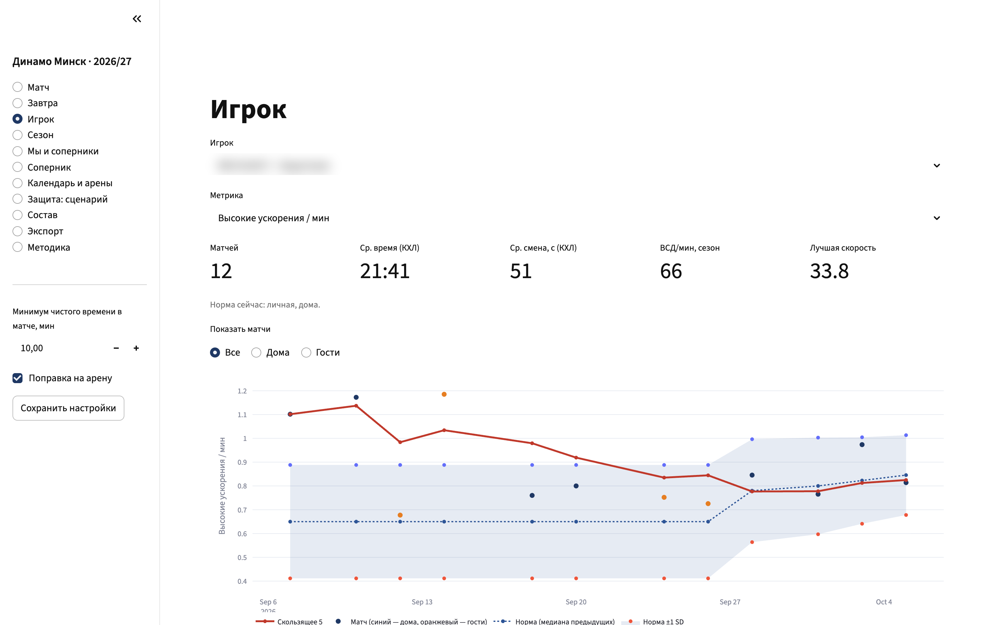
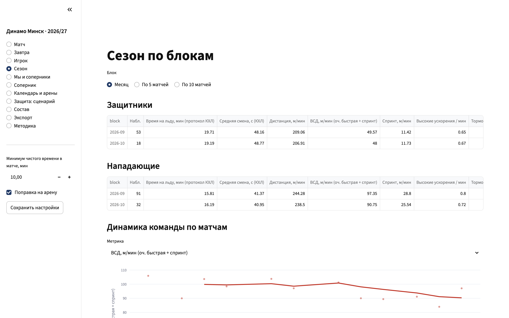
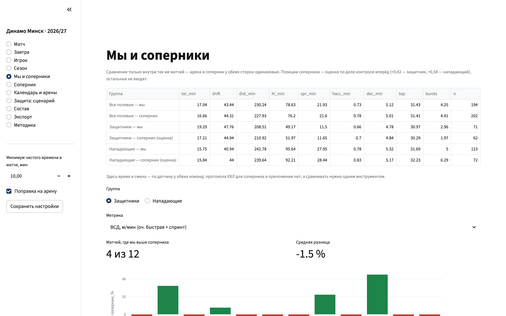
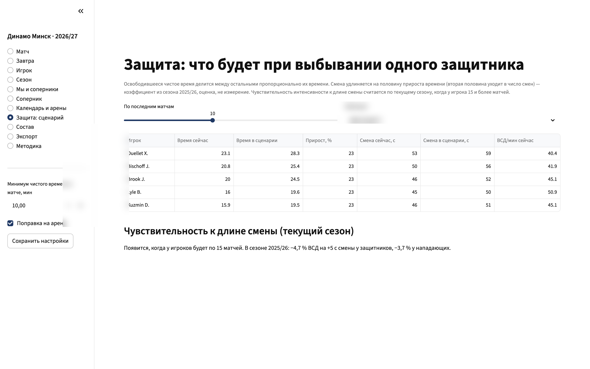
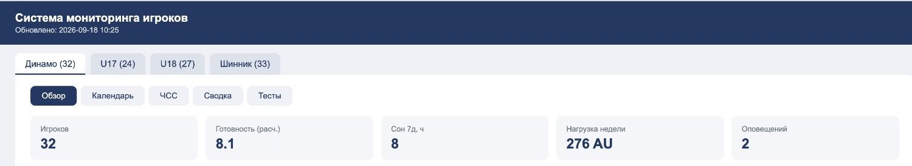
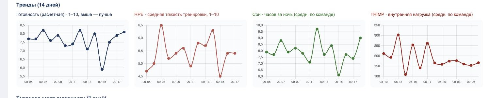

# Sport Performance Systems — Алексей Дашкевич / Alexei Dashkevich

**RU** · [EN below](#english)

Тренер по физической подготовке в профессиональном хоккее (КХЛ, сборные Беларуси, игроки НХЛ), который проектирует и внедряет цифровые системы вокруг спортивного процесса — без разработчиков в штате. Решения принимаю я, код пишут ИИ-агенты (Claude Code, Cursor, Codex) под инженерными правилами: спецификация до кода, тесты как ворота деплоя, репозиторий как единственный источник правды.

Контакты: +375 44 710-75-61 · Telegram: @the_dashkevich · dashkevich.training@gmail.com · [LinkedIn](https://www.linkedin.com/in/aleksey-dashkevich/)

---

## Кейс 1 · Аналитический контур команды КХЛ («Billy Beane для штаба»)

Отчёты по матчам, прескауты и ежедневный мониторинг для тренерского штаба клуба КХЛ. 116 игроков, 4 команды, 1 человек.

**Проблема.** Данные игры лежали в трёх источниках (датчики Wisehockey, портал лиги, протокол матча) и сводились вручную. Разбор доходил до штаба через день-два — после того, как решения по нагрузке уже приняты.

**Решение — пять шагов, каждый воспроизводится без автора:**

1. **Сбор** — агент забирает данные с портала лиги и файлов матча автоматически.
2. **Проверка** — матч с частичной записью датчика исключается; игрок без датчика отмечается; разные написания одной фамилии сводятся по номеру; дубли событий снимаются. Это шаг, из-за которого система не врёт.
3. **Расчёт** — правила тренера в коде (длина смены, спад скорости к третьему периоду, опасная зона броска), нормализация на минуту и смену, индивидуальные нормы по окну 10 матчей.
4. **Сборка** — отчёт по матчу 5 страниц в день игры, прескаут 3 страницы, фиксированный формат.
5. **Доставка** — PDF в рабочую папку штаба; скрипты и данные рядом, любой прошлый отчёт воспроизводится один в один.

**Результат.** ≈400 смен и 210 событий за матч автоматически; 9 документов за 11 дней, ни один не собран вручную. Помимо отчётов штаб получил веб-приложение (Streamlit) на данных Wisehockey и протоколов КХЛ.

*Раздел «Матч»: контекст игры (арена, бэк-тубэк, овертайм) и флаги отклонений — каждый игрок против своей личной нормы, дом/гости раздельно. Фамилии скрыты.*

*Раздел «Игрок»: индивидуальная норма по скользящему окну последних матчей, коридор ±1 SD, флаги выхода за коридор.*

*Раздел «Сезон»: команда по блокам (месяц / 5 / 10 матчей) — динамика нагрузки защитников и нападающих.*

*Раздел «Мы и соперники»: наши показатели против средних лиги на той же позиции — сравнение одним инструментом.*

*Раздел «Защита: сценарий»: пересчёт минут и длины смен при выбывании защитника — подготовка к кадровой потере до матча.*

## Кейс 2 · Платформа мониторинга спортсменов

Ежедневный сбор данных о самочувствии и нагрузке 116 игроков четырёх команд, один экран для штаба.

- Опросники в Telegram (сон, боль, вес, тяжесть работы отдельно для зала и льда); тренер ставит свою оценку той же тренировки — система показывает расхождение с оценкой игрока.
- Пульсовые сессии Polar → TRIMP по индивидуальному максимуму ЧСС; интеграции WHOOP (recovery, HRV, сон).
- Правила-флаги с рекомендацией: «осмотр у физио», «контроль нагрузки и сна». Оповещение всегда заканчивается действием, иначе его игнорируют.
- Дисциплина данных: «не отвечает» и «нет данных» разведены; проценты не считаются по пустому знаменателю.
- Миграция с Google Apps Script на Cloudflare Workers + D1: TypeScript, тесты, CI/CD, staging/prod, модель угроз, шифрование токенов.

*Дашборд: готовность команды, сон, нагрузка недели, оповещения с действием.*

*Тренды: готовность, RPE, сон, TRIMP за 14 дней.*

## Что переносится за пределы спорта

Ежедневный сбор данных от людей, которые не обязаны их сдавать; сведение ручного ввода, выгрузок с устройств и внешних отчётов в одни единицы; пороги и оповещения, заданные владельцем процесса; дисциплина данных, при которой система показывает, где данных нет. Это работает в любой отчётности от людей: опросы сотрудников, чек-листы смены, отчётность подрядчиков.

## Принцип работы

Правила предметной области записаны в проверяемом виде и подписаны как мои. Приёмка — по числам, а не «выглядит лучше». Код пишет агент, за результат отвечаю я. Рабочие репозитории приватны (персональные данные спортсменов); полные примеры отчётов — по запросу, данные клубов не публикуются.

---

<h2 id="english">English</h2>

Strength & conditioning coach in professional hockey (KHL, Belarus national teams, NHL players) who designs and ships digital systems around the sports process — no developers on payroll. I own architecture and decisions; AI agents (Claude Code, Cursor, Codex) write the code under my engineering rules: specification before code, tests as deployment gates, repository as the single source of truth.

**Case 1 — Match analytics for a KHL coaching staff.** Automated pipeline (collect → validate → coach's rules in code → fixed-format report → delivery): ~400 shifts and 210 events processed per game; 9 documents in 11 days, zero manual assembly. Data validation before calculation is what makes the system truthful. The staff also got a Streamlit application on Wisehockey sensor data and KHL official protocols — screenshots above (player names blurred).

**Case 2 — Athlete-monitoring platform.** Daily wellness/load collection for 116 athletes across 4 teams: Telegram survey bots, Polar → TRIMP, WHOOP recovery/HRV, rule-based alerts that always end with a recommended action, data discipline (NULL ≠ 0, no percentages over empty denominators). Migrated from Google Apps Script to Cloudflare Workers + D1 with tests, CI/CD, staging/prod and a threat model.

Athlete personal data is anonymised in all public materials. Full report samples and working repositories are available on request.

Contacts: +375 44 710-75-61 · Telegram: @the_dashkevich · dashkevich.training@gmail.com · [LinkedIn](https://www.linkedin.com/in/aleksey-dashkevich/)
